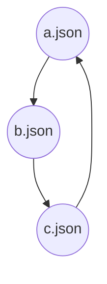

# Avocado

Another Validator of OpenAPI spec repository Configuration And Directories.

[](https://dev.azure.com/azure-sdk/public/_build/latest?definitionId=120&branchName=master)

NPM: https://www.npmjs.com/package/@azure/avocado

## Overview

Avocado validates folder structure and configuration.

Avocado can be integrated into Azure pipeline to validate OpenAPI spec repository. For example, Avocado is used by `Azure/azure-rest-api-specs` now that will trigger automatically by azure DevOps pipeline when a new pull request is created.

Avocado major functions are listed below:

- For a given directory validate whether exists `specification` and filter `readme.md` under the `specification` folder.
- Validate whether `readme.md` is autorest specific file which must contain `see https://aka.ms/autorest`
- Validate whether `swagger file` is valid json file, and check all referenced `json` file (`referenced json` file marked in json object has the key name `"$ref"`).
- Validate whether the folder has any files without being referenced. `swagger file` must be referenced by `readme.md` or other `swagger file`.
- Validate whether `swagger file` has a circular reference and report a warning. For more detail, see [CIRCULAR REFERENCE](#CIRCULAR REFERENCE)

## How to use

### install

`npm install -g Azure/avocado`

### usage

`avocado`

When type avocado in command line, avocado will validate in the current directory.

NOTE: When running in azure devops Avocado only report new errors involved in PR, but ignore the previous existing errors. When running in local machine, Avocado report all errors.

### example

Run all specs: Clone the repo `azure/azure-rest-api-specs` and run "avocado" in folder `azure/azure-rest-api-specs`.

Run single service specs: create a folder `specification`. and move your service specs folder in `specification`. run "avocado"

## How to solve errors

### CIRCULAR REFERENCE

Level: WARNING

To solve circular reference, you should break the circular chain. 

Example: `a.json` -> `b.json`->`c.json`

```json
// a.json
{
	$ref: "b.json"
}
```

```json
// b.json
{
	$ref: "c.json"
}
```

```json
// c.json
{
	$ref: "a.json"
}
```



## Contributing

This project welcomes contributions and suggestions. Most contributions require you to agree to a
Contributor License Agreement (CLA) declaring that you have the right to, and actually do, grant us
the rights to use your contribution. For details, visit https://cla.microsoft.com.

When you submit a pull request, a CLA-bot will automatically determine whether you need to provide
a CLA and decorate the PR appropriately (e.g., label, comment). Simply follow the instructions
provided by the bot. You will only need to do this once across all repos using our CLA.

This project has adopted the [Microsoft Open Source Code of Conduct](https://opensource.microsoft.com/codeofconduct/).
For more information see the [Code of Conduct FAQ](https://opensource.microsoft.com/codeofconduct/faq/) or
contact [opencode@microsoft.com](mailto:opencode@microsoft.com) with any additional questions or comments.