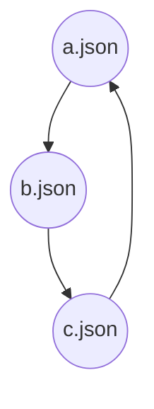

# Avocado

Another Validator of OpenAPI spec repository Configuration And Directories.

[](https://dev.azure.com/azure-sdk/public/_build/latest?definitionId=120&branchName=master)

NPM: https://www.npmjs.com/package/@azure/avocado

## Overview

Avocado validates folder structure and configuration.

Avocado can be integrated into Azure pipeline to validate OpenAPI spec repository. For example, Avocado is used by `Azure/azure-rest-api-specs` now that will trigger automatically by azure DevOps pipeline when a new pull request is created.

Avocado major functions are listed below:

- For a given directory validate whether exists `specification` and filter `readme.md` under the `specification` folder.
- Validate whether `readme.md` is autorest specific file which must contain `see https://aka.ms/autorest`
- Validate whether `swagger file` is valid json file, and check all referenced `json` file (`referenced json` file marked in json object has the key name `"$ref"`).
- Validate whether the folder has any files without being referenced. `swagger file` must be referenced by `readme.md` or other `swagger file`.
- Validate whether `swagger file` has a circular reference and report a warning. For more detail, see [CIRCULAR REFERENCE](#circular-reference)
- Validate whether each RP folder contains readme file for SDK generation.

## How to use

### Install

`npm install -g @azure/avocado`

### Usage

- `avocado -h` show help message
- `avocado` validate current directory
- `avocado -d <my-folder-path>` validate `<my-folder-path>` directory
- `avocado -d <my-folder-path> --excludePaths 'common-types'` validate folder and exclude errors from 'common-types'

### Example

- Run all specs: Clone the repo `azure/azure-rest-api-specs` and run "avocado" in folder `azure/azure-rest-api-specs`.
- Run single service specs: create a folder `specification`. and move your service specs folder in `specification`. run "avocado"

## How to solve errors

### JSON_PARSE

Level: ERROR

To solve json parse error, you need make sure the json format is valid.

### NO_JSON_FILE_FOUND

Level: ERROR

Readme file references a non-existing json file. To solve the error you need to check whether the json file is existing.

### UNREFERENCED_JSON_FILE

Level: ERROR

Json file must be referenced by the readme input file section or other json files. Eg, example swagger file should be referenced by main swagger json and for SDK generation main swagger should be referenced by the readme input file section. To solve the error you need to place the non-referenced file to proper place.

### MISSING_README

Level: ERROR

Each resource provider folder must have a readme file which is required by downstream SDK generation. To solve the error, you need create a readme file contains SDK generation config.

### NOT_AUTOREST_MARKDOWN

Level: ERROR

Each readme in resource provider folder should follow autorest markdown format. To solve the error, you need check the readme block quote whether contains `see https://aka.ms/autorest` literally.

### INCONSISTENT_API_VERSION

Level: ERROR

Swagger json file api version must consistent with its file path. Swagger can define [swagger 2.0 basic-structure](https://swagger.io/docs/specification/2-0/basic-structure/) which contains api version. To solve the error, you need modify either your swagger file location or swagger file api version to make both of them consistent.

### CIRCULAR_REFERENCE

Level: WARNING

To solve circular reference, you should break the circular chain.

Example: `a.json` -> `b.json`->`c.json`

```json
// a.json
{ "$ref": "b.json" }
```

```json
// b.json
{ "$ref": "c.json" }
```

```json
// c.json
{ "$ref": "a.json" }
```



### MULTIPLE_API_VERSION

Level: WARNING

The default tag should contain only one API version swagger.

To solve this warning , you should copy the swaggers of old version into the current version folder.

### INVALID_FILE_LOCATION

Level: WARNING

The management plane swagger JSON file does not match its folder path. Make sure management plane swagger located in resource-manager folder

To solve this warning, you should make sure manager plane swagger located in resource-manager folder.

## Contributing

This project welcomes contributions and suggestions. Most contributions require you to agree to a
Contributor License Agreement (CLA) declaring that you have the right to, and actually do, grant us
the rights to use your contribution. For details, visit https://cla.microsoft.com.

When you submit a pull request, a CLA-bot will automatically determine whether you need to provide
a CLA and decorate the PR appropriately (e.g., label, comment). Simply follow the instructions
provided by the bot. You will only need to do this once across all repos using our CLA.

This project has adopted the [Microsoft Open Source Code of Conduct](https://opensource.microsoft.com/codeofconduct/).
For more information see the [Code of Conduct FAQ](https://opensource.microsoft.com/codeofconduct/faq/) or
contact [opencode@microsoft.com](mailto:opencode@microsoft.com) with any additional questions or comments.
